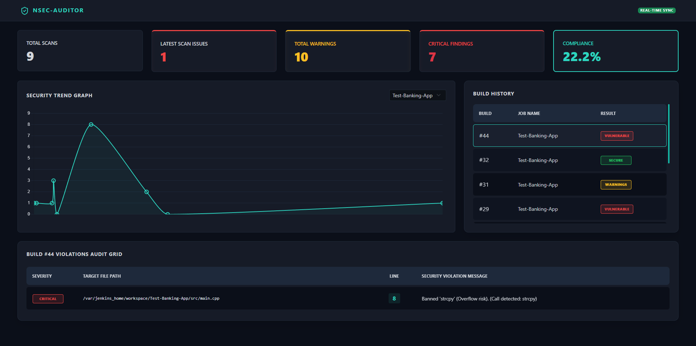

# cpp-nsec-auditor


A high-performance C++ static security auditor designed for "IT for IT" productivity and DevSecOps integration. This tool demonstrates technical maturity in C++ systems programming and automated security pipelines.

## 📷 Demo video
[](https://youtu.be/x0DHP8OiLT0)

## 🚀 Overview

cpp-nsec-auditor is a modular static analysis tool that scans C++ source files to identify security vulnerabilities (e.g., banned functions like strcpy) and maintainability risks (e.g., excessive nesting depth). It features a parallelized C++ engine and a Python-based orchestration layer.

## 🖥️ Visualization Suites

### **1. Security Dashboard (Flask)**

The dashboard is designed for centralized monitoring of reports across multiple builds.
1.  **Setup**: `pip install flask`
2.  **Start**: `python dashboard-ui/app.py`
3.  **View**: Open `http://127.0.0.1:5000` in your browser.
4.  **Logic**: It automatically polls the `reports/` folder. Every time a new report is generated, the dashboard updates with trend charts, severity distributions, and violation grids.

### **2. Live Monitor UI (C++ TUI)**
When performing manual audits, use the `--monitor` flag with the core engine (`core-engine/build`).
* **Progress Tracking**: Total scans count.
* **Live Stream**: Updates if a new report is generated.
* **Summary**: Displays total number of issues (critical issues and warnings) blocked.

## ✨ Core Engine Key Features

*   **High-Performance Core**: Leverages `std::async` for parallel file processing, maximizing CPU utilization during large-scale scans.
*   **Modular Rule Engine**: An extensible orchestrator managing a suite of security and logic checks through the `ISecurityRule` interface.
*   **Thread-Safe Reporting**: Consolidated findings into a JSON format optimized for dashboard consumption and CI/CD pass/fail logic.
*   **Centralized Intelligence Hub**: A Flask-powered dashboard providing real-time visibility into security trends, compliance scores, and actionable violation logs.

## 🎣 Local Enforcement (The Guardrail)

To prevent security vulnerabilities from ever reaching the repository, this project implements a **Surgical Guardrail** using Git pre-commit hooks.

*   **Surgical Scanning**: Identifies **only the files currently in the Git staging area** to maintain developer productivity with near-instant feedback.
*   **Easy Deployment**: Includes an automated installation script (`install_hooks.py`) for team-wide deployment.

**See "CLI Reference"" section for detailed usage**

## 🏗️ Core Engine Architecture

The project is built with **C++20** and follows a modular design:
*   **`nsec::core`**: Orchestration logic and rule interfaces.
*   **`nsec::models`**: Thread-safe `Issue` and `Report` data structures.
*   **`nsec::rules`**: Concrete implementations of security and complexity checks.

## 🔍 Detection Rules

The engine utilizes a modular rule system where each check implements the `ISecurityRule` interface.

### 1. SEC_BANNED_FUNCTIONS

* **Target**: Flagging functions like `strcpy`, `gets`, `strcat`, and `sprintf` when used without bounds checking.
* **Logic**: Uses regex-based pattern matching to identify function call sites while respecting source ranges to avoid false positives in comments or strings.

### 2. COMPLEXITY_NESTING_DEPTH

* **Target**: Functions with deeply nested logic branches (e.g., `if` inside `for` inside `switch`).
* **Logic**:
    * **Max Depth**: Blocks code exceeding the absolute allowed nesting limit (Default: 4).
    * **Deep Scope Warning**: Identifies "Deep Scopes" (depth level 3).
    * **Scope Length**: Flags "Deep Scopes" that exceed a specific line count (Default: 25 lines), forcing developers to refactor complex logic into smaller, testable functions.
* **Impact**: Drastically reduces cyclomatic complexity and improves long-term maintainability.

## 📂 Project Structure
```text
cpp-nsec-auditor/
├── assets/                  # Documentation assets (Videos, Images)
├── cicd/                    # Jenkinsfile samples for pipeline integration
├── core-engine/             # C++ Static Analysis Engine source code
│   ├── include/             # Headers (core, models, rules, ui, utils)
│   ├── src/                 # Implementation files
│   └── vendor/              # Third-party (nlohmann/json)
├── dashboard-ui/            # Flask-based Security Intelligence Hub
│   ├── app.py               # Telemetry API
│   └── templates/           # Dashboard UI
├── git-hooks/               # Pre-commit hook templates
├── jenkins-library/         # Global Jenkins Shared Library (Groovy)
├── scripts/                 # Python orchestrator for "Surgical Guardrail"
├── samples/                 # Vulnerable C++ code for UAT
├── reports/                 # Default out folder for generated reports (samples provided)
├── install_hooks.py         # Deployment script for developers
└── README.md
```

## ⛓️ CI/CD & Enterprise Automation

This project features a production-ready **Jenkins Shared Library** (`jenkins-library/`), allowing security audits to be standardized across an entire organization.

*   **Standardized Security Gates**: Provides a global `nsecAudit()` function for any pipeline.
*   **Centralized Telemetry**: Each CI/CD run pushes results to the **Security Intelligence Hub**.

## 🔄 The DevSecOps Workflow

1.  **Code**: Developer adds a prohibited function (e.g., `strcpy`).
2.  **Commit**: `git commit` triggers the **Surgical Guardrail** to run a local audit.
3.  **Push**: Code is pushed to Jenkins, where the **Shared Library** performs a final compliance check.
4.  **Monitor**: Results are instantly visualized on the **NSEC Dashboard** (`dashboard-ui`).

## 🛠️ CLI Reference

### **The Core Engine (`nsec_core`)**
Located in `core-engine/build/`.
| Argument | Type | Description |
| :--- | :--- | :--- |
| `[paths...]` | Positional | One or more files or directories to analyze. |
| `--output, -o` | String | Path to save the structured JSON report. |
| `--monitor` | Flag | Launches the real-time Terminal UI with progress bars. |

**Example:** `./nsec_core ./src --output reports/manual.json --monitor`

### **The Orchestrator (`scripts/nsec_wrapper.py`)**
The intelligent bridge managing Git state and auto-builds.
| Argument | Description |
| :--- | :--- |
| `--path` | The path to the `cpp-nsec-auditor` tool root (**required if not launchimg from auditor source directory**). |
| `--engine-path` | Explicitly provides a path to the binary (bypasses auto-discovery). |
| `--job-name` | Metadata: Injects the Jenkins/CI job name into the report. |
| `--build-id` | Metadata: Injects the Jenkins/CI build number into the report. |

**Example:** `python scripts/nsec_wrapper.py --path "/opt/nsec" --job-name "Internal-API" --build-id 42`

### **The Installer (`install_hooks.py`)**
Deployment tool that patches and installs the Git guardrail into target repositories.
| Argument | Description |
| :--- | :--- |
| `[target]` | The path to the project to protect (Defaults to current dir). |

**Example:** `python install_hooks.py C:/Users/Dev/Projects/MyBankingApp`

## **📊 Core Engine: Monitor Mode**

The C++ engine includes a high-performance **Monitor Mode** for real-time console visualization of the audit process.

### **Using the \--monitor Flag**

When running the core engine directly, use the \--monitor flag to enable a live terminal UI:

```bash
./core-engine/build/nsec_core \--monitor [optional_reports_path]
```

* **What it does**: Instead of standard logging, it launches a thread-safe terminal UI that displays details about the JSON reports in the specified (or default) reports folder.  
* **Best for**: local reports details / summary

## 🛠️ Prerequisites

Before building and running **cpp-nsec-auditor**, ensure your environment meets the following minimum requirements:

*   **C++ Compiler**: A **C++20 compliant compiler** is required (e.g., GCC 10+, Clang 10+, or MSVC 19.28+).
*   **Build System**: **CMake 3.15** or higher is necessary for project configuration.
*   **Python Environment**: **Python 3.8+** must be installed to run the orchestrator wrapper and the Git hook installer.
*   **Web Dashboard**: **Flask** is required to host the Security Intelligence Hub.
*   **Version Control**: **Git** is essential for the **Surgical Guardrail** to identify staged files and to install pre-commit hooks.

## 📄 License
This project is licensed under the MIT License.
